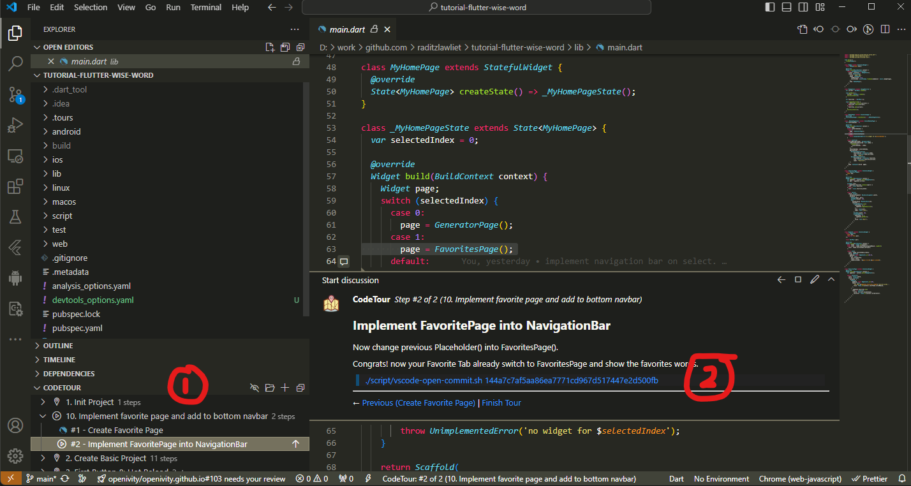
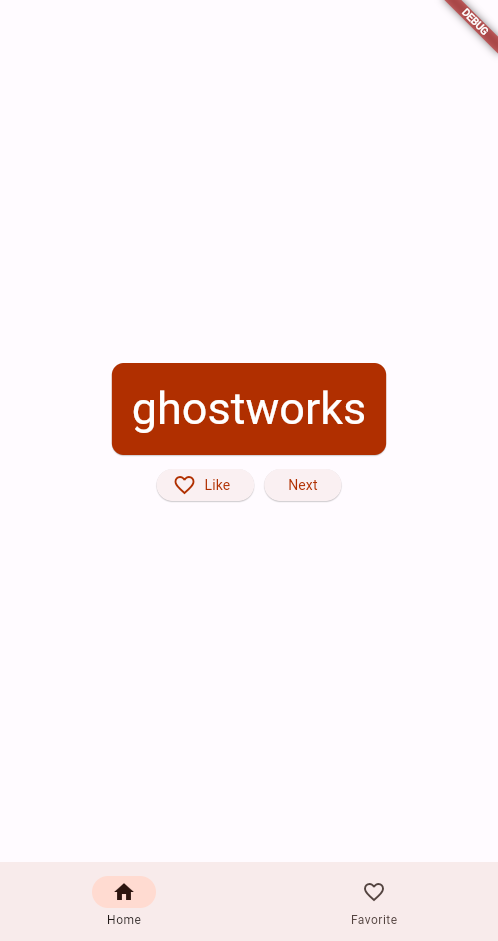

# Tutorial - Flutter Wise Word

a Generator Wise Word with flutter for mobile with Codetour for tutorial purpose.

    
    

## What's covered

- The basics of how Flutter works
- Creating layouts in Flutter
- Connecting user interactions (like button presses) to app behavior
- Keeping your Flutter code organized
- Switching page with Navigation Bar
- Achieving a consistent look & feel of your app

## Not mentioned

- Reference Material from: https://codelabs.developers.google.com/codelabs/flutter-codelab-first
  - Using Navigation Bar instead Navigation Rail
- Target: Mobile
- Including Code Tour
  - Each topic has spesific commit
  - Script to automatically reclone with spesific commit, see on [vscode-open-commit.sh](./script/vscode-open-commit.sh)

## How to use

- Clone repository
- Open with VSCode, Flutter SDK and Mobile (Android or iOS) SDK
- Enable Flutter and Dart VSCode extension
- Enable Codetour VSCode extension (https://marketplace.visualstudio.com/items?itemName=vsls-contrib.codetour)
- Follow Codetour topic and step, each topic has script to automatically reclone with spesific commit.

## Support

If you have any questions or encounter any issues, feel free to open an issue and we will assist you in resolving them.

## Contribute

Feel free to contribute, don't forget to mention if needed

## Author and Contributor

- [@raditzlawliet](https://github.com/raditzlawliet/)
